# 

The TGIF-QA dataset contains 165K QA pairs for the animated GIFs from the [TGIF dataset](https://arxiv.org/abs/1604.02748) [Li et al. CVPR 2016]. The question & answer pairs are collected via crowdsourcing with a carefully designed user interface to ensure quality. The dataset can be used to evaluate video-based Visual Question Answering techniques.


In this page, you can find the [code](code/README.md) and the [dataset](dataset/README.md) for our **IJCV** journal article.

* Yunseok Jang, Yale Song, Chris Dongjoo Kim, Youngjae Yu, Youngjin Kim and Gunhee Kim. *Video Question Answering with Spatio-Temporal Reasoning*. *IJCV*, 2019. [[Journal Link]](https://link.springer.com/article/10.1007/s11263-019-01189-x)


Please check [this tag](https://github.com/YunseokJANG/tgif-qa/tree/cvpr2017) if you are interested in our CVPR 2017 setting.


The code and the dataset are free to use for academic purposes only. If you use any of the material in this repository as part of your work, we ask you to cite:

```
@article{jang-IJCV-2019,
    author    = {Yunseok Jang and Yale Song and Chris Dongjoo Kim and Youngjae Yu and Youngjin Kim and Gunhee Kim},
    title     = {{Video Question Answering with Spatio-Temporal Reasoning}}
    journal   = {IJCV},
    year      = {2019}
}
```

Note: Since our CVPR 2017 paper, we extended our dataset by collecting more question and answer pairs (the total count has increased from 104K to 165K) and re-ran experiments with the new dataset. The journal article and the arXiv paper is the most update one.


Have any question? Please contact:

Yunseok Jang [(yunseok.jang@snu.ac.kr)](mailto:yunseok.jang@snu.ac.kr), Chris Dongjoo Kim [(cdjkim@vision.snu.ac.kr)](mailto:cdjkim@vision.snu.ac.kr), and Yale Song [(yalesong@microsoft.com)](mailto:yalesong@microsoft.com)


## Q&A Types and Examples

| Q&A Type           | Repetition Count                  | Repeating Action              | State Transition                         | Frame QA                          |
| :----------------- | --------------------------------- | ----------------------------- | ---------------------------------------- | --------------------------------- |
| Visual Input (GIF) | 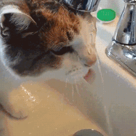              | 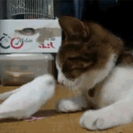          | 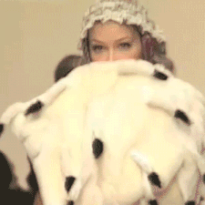                     | 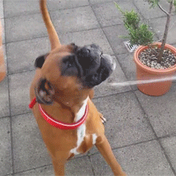              |
| Question           | How many times does the cat lick? | What does the cat do 3 times? | What does the model do after lower coat? | What is the color of the bulldog? |
| Answer             | 7 times                           | Put head down                 | Pivot around                             | Brown                             |


## \# Q&A Pairs

| Task             |       Train |       Test |       Total |
| :--------------- | ----------: | ---------: | ----------: |
| Repetition Count |      26,843 |      3,554 |      30,397 |
| Repeating Action |      20,475 |      2,274 |      22,749 |
| State Transition |      52,704 |      6,232 |      58,936 |
| Frame QA         |      39,392 |     13,691 |      53,083 |
| **Total**        | **139,414** | **25,751** | **165,165** |


## Quantitative Results

| Model                                    | Repetition Count (L2 loss)   | Repeating Action (Accuracy) | State Transition (Accuracy) | Frame QA (Accuracy) |
| ---------------------------------------- | ---------------------------: | --------------------------: | --------------------------: | ------------------: |
| Random Chance                            |                        19.62 |                       20.00 |                       20.00 |                0.06 |
| Most Frequent words                      |                         7.78 |                       31.40 |                       30.05 |               17.49 |
| [VIS+LSTM](https://arxiv.org/abs/1505.02074) (aggr) [NIPS 2015] |  5.09 |                       46.84 |                       56.85 |               34.59 |
| [VIS+LSTM](https://arxiv.org/abs/1505.02074) (avg) [NIPS 2015] |   4.81 |                       48.77 |                       34.82 |               34.97 |
| [VQA-MCB](https://arxiv.org/abs/1606.01847) (aggr) [EMNLP 2016] |  5.17 |                       58.85 |                       24.27 |               25.70 |
| [VQA-MCB](https://arxiv.org/abs/1606.01847) (avg) [EMNLP 2016] |   5.54 |                       29.13 |                       32.96 |               15.49 |
| [CT-SAN](https://arxiv.org/abs/1610.02947) [CVPR 2017] |           5.14 |                       56.14 |                       63.95 |               39.64 |
| [Co-Memory](https://arxiv.org/abs/1803.10906) [CVPR 2018] |      **4.10** |                       68.20 |                       74.30 |               51.50 |
| **ST-VQA (Ours)**                          |                         4.22 |                     **73.48** |                     **79.72** |             **51.96** |


## Qualitative Results

### Spatial Attention


### Temporal Attention

The red dotted boxes over heatmaps indicate segments in a video that include the ground-truth answers.


### Attentions Visualized in Time

The yellow bar indicates the strength of temporal attention at the visualized time.

| Q&A Type           | Repetition Count                  | Repeating Action              | State Transition                         | Frame QA                          |
| :----------------- | --------------------------------- | ----------------------------- | ---------------------------------------- | --------------------------------- |
| Lively Visual (GIF) | 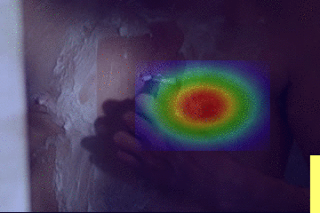       | 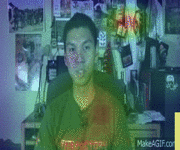   |  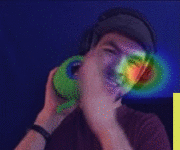        | 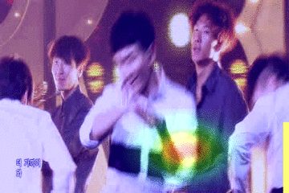       |
| Question           | How many times does the man shave chest ? | What does the boy do 3 times ? | What does the man do before kiss toy ? | What are the group of boys singing , dancing , and playing ? |
| Answer             | 2 times                           | Wave hands                 | Pet toy                             | Instruments                             |
| Lively Visual (GIF) | 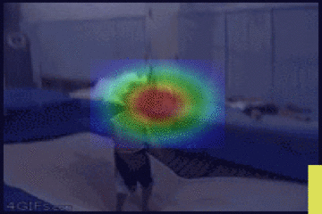              | 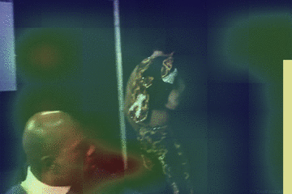          | 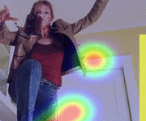  | 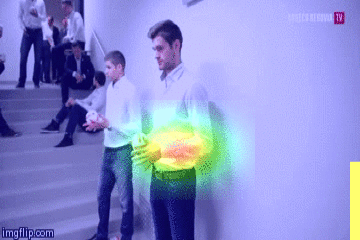              |
| Question           | How many times does the man flip circle ? | What does the behind do 3 times ? | What does the woman do after raise leg ? | What is the color of the shirt ? |
| Answer             | 2 times                           | Shake butt                | Kick a mug                             | White                             |


## Notes

Last Edit: May 22, 2020
