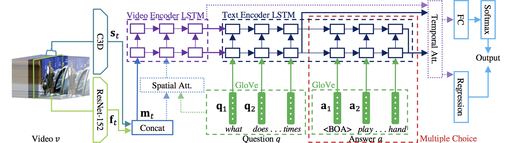

# Code

ST-VQA model
-----




## Setup Instructions ##
-----

1. set a conda environment
    ```
    conda create -n tgifqa -y
    source activate tgifqa
    conda install -c conda-forge python=2.7.15 -y
    conda install -c conda-forge mkl mkl-include enum34 -y
    conda install -c anaconda tensorflow-gpu=1.4.1 tensorflow-tensorboard=0.4.0 cudatoolkit=8.0 cudnn=7.1.3 backports.weakref=1.0.post1 -y
    ```

2. Install python modules

    ```
    pip install -r requirements.txt
    python -m spacy download en_core_web_sm
    ```

3. Set TGIF-QA dataset and related files in this (HOME/code) folder.

    ```
    mkdir dataset
    mkdir dataset/tgif
    cp -r ../dataset dataset/tgif/DataFrame
    mkdir dataset/tgif/features dataset/tgif/Vocabulary ../dataset/word_vectors
    ```

4. Download GIF files in [dataset](../dataset/README.md) page and extract the zip file it into `dataset/tgif/gifs`.

5. Download crawl-300d-2M.vec from FastText[https://fasttext.cc/docs/en/english-vectors.html] and move it to the `HOME/dataset/word_vectors` folder.

Note: Since the codebase was implemented and used in 2018, some packages may include major updates, which could bring a slight difference in performance.


## Pre-processing the visual features ##
-----

1. Download GIF files into your directory.

2. Install ffmpeg.

3. Extract all GIF frames into a separate folder.

    ```bash
    ./save-frames.sh dataset/tgif/{gifs,frames}
    ```


4. If using optical flow, perform this step, otherwise, skip it. Use Farneback's dense optical flow to extract flows for each gifs, and store it as input to the ResNet in the next step.

If not, extract [ResNet-152](https://github.com/KaimingHe/deep-residual-networks) and [C3D](https://github.com/facebook/C3D) features by using each pretrained models.
    - Extract 'res5c', 'pool5' for ResNet-152, and 'conv5b', 'fc6' for C3D.
    - If a GIF file contains less than 16 frames, append the last frame to have 16 frames at least.
    - When extracting the C3D features, use stride 1 pad the first frame eight times for the first frame, and pad the last frame 7 time for the very last frame (SAME padding).


5. Wrap each extracted features into hdf5 files per layer, name them as 'TGIF_[MODEL]_[layer_name].hdf5' (ex, TGIF_C3D_fc6.hdf5, TGIF_RESNET_pool5.hdf5, TGIF_ResOF_pool5.hdf5), and save them into 'code/dataset/tgif/features'. For example, pool5 feature and res5c feature need to be stored in a different hdf5 file. Each feature file should have to be a dictionary that uses 'key' field of each dataset file as the key of a dictionary and a numpy array of extracted features in (\#frames, feature dimension) shape.


Note. We uploaded three hdf5 files ( [Resnet_pool5](https://drive.google.com/file/d/0B15H16jpV4w2SlVleTBRT3dUTGs/view?usp=sharing), [C3D_fc6](https://drive.google.com/file/d/0B15H16jpV4w2cFZoOXpPMlFLX3M/view?usp=sharing), [ResOF_pool5](https://drive.google.com/open?id=1pTNlcT6jkyzd-irw4BxnUIbTdAJYrPBB) ), but we failed to upload the other two files because of its size.


Training
-----

* Choose task [Count, Action, FrameQA, Trans] and model name [C3D, Resnet, Concat, Tp, Sp, SpTp]
* Run python script
    ```
    cd gifqa
    python main.py --task=Count --name=Tp
    ```


Evaluation
-----

* Choose task [Count, Action, FrameQA, Trans], model name [C3D, Resnet, Concat, Tp, Sp, SpTp] and set checkpoint path
* Run python script
    ```
    cd gifqa
    python main.py --task=Count --name=Tp --checkpoint_path=YOUR_CHECKPOINT_PATH --test_phase=True --evaluate_only=True
    ```


Run Pretrained Models
-----

* Download checkpoints for concat and temporal models from [this link](https://drive.google.com/open?id=1BLZk64qNc3Ud7G3gMtvJGMkdX5GApCvP) and place checkpoint folders in `gifqa/pretrained_models`. Additionally, copy the unzipped fasttext folder to the `HOME/dataset` directory.

* Run test script
    ```
    cd gifqa
    ./test_scripts/{task}_{model}.sh
    ```

## Notes

Last Edit: May 22, 2020
